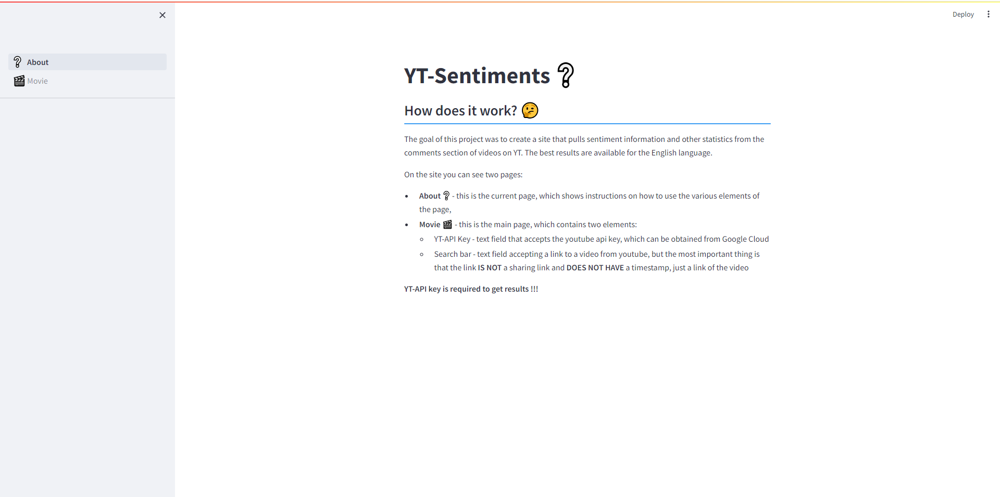

# YT-Sentiments

The goal of this project was to create a site that pulls sentiment information and other statistics from the comments section of videos on YT. <br>
The best results are available for the English language.

# How it works

The application includes two pages:

- **About** ❔ - this is the current page, which shows instructions on how to use the various elements of the page,
- **Movie** 🎬 - this is the main page, which contains two elements:
    - YT-API Key - text field that accepts the youtube api key, which can be obtained from Google Cloud
    - Search bar - text field accepting a link to a video from youtube, but the most important thing is that the link **IS NOT** a sharing link and **DOES NOT HAVE** a timestamp, just a link of the video

**YT-API key is required to get results !!!**



<br>

# Installation

The project uses models from the HuggingFace platform:
- cardiffnlp/twitter-roberta-base-sentiment-latest
- bhadresh-savani/roberta-base-emotion

which are most often built on PyTorch or Tensorflow. In this case, PyTorch. It will be installed for this purpose, but in order for the model to run faster you need an NVIDIA graphics card and CUDA and cuDNN drivers.

Download a repository
```
> git clone https://github.com/mateo252/YT-Sentiments.git

> cd YT-Sentiments
```

Create a virtual environment and install requirements (require Python <= 3.12)

```
> python -m venv venv

> venv\Scripts\activate

(venv) > pip install -r requirements.txt
```

Finally run a project
```
(venv) > cd src

(venv) > streamlit run ❔About.py
```

# License
MIT